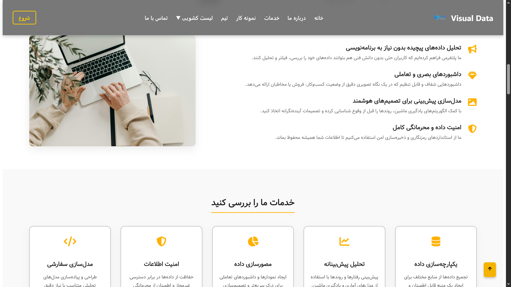
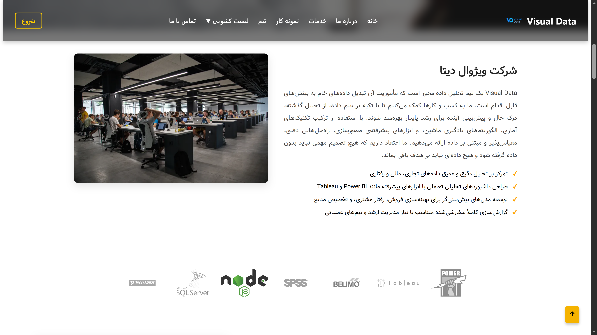
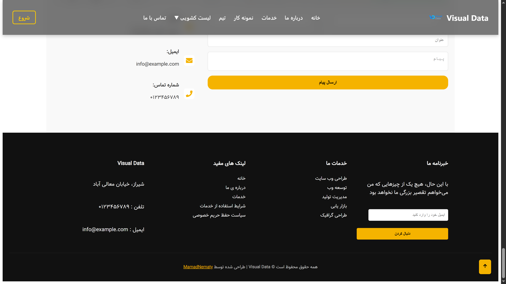
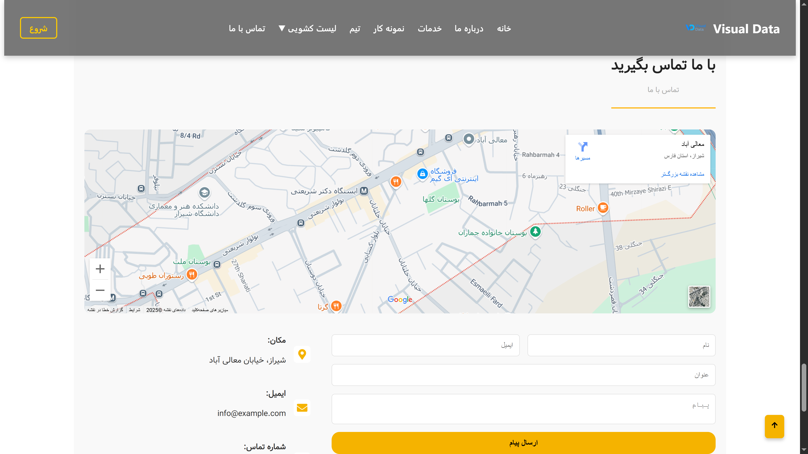

# 📊 ویژوال دیتا (Visual Data)

<h3 align="center">📸 پیش‌نمایش رابط کاربری پروژه</h3>

  
  
  

  
  
  

  
  
  

 

**وب‌سایت تحلیلی و واکنش‌گرا** طراحی‌شده با React — تمرینی برای ساخت رابط کاربری کامپوننت‌محور و پیاده‌سازی ساختار یک شرکت داده‌محور. در این پروژه از کتابخانه Swiper برای نمایش کلاینت‌ها استفاده شده است.

<!-- [🔗 مشاهده دمو آنلاین ](https://mamadnematy.github.io/Visual-Data/) -->

---

## 🧠 درباره پروژه

ویژوال دیتا یک وب سایت تمرینی برای معرفی یک شرکت فرضی تحلیل داده می باشد که این پروژه با استفاده از React طراحی شده و در آن سعی شده قابلیت های زیر به نمایش گذاشته شود:

- طراحی صفحات کامپوننت‌محور با React
- استفاده از Swiper.js برای اسلایدر حرفه‌ای
- طراحی واکنش‌گرا برای موبایل، تبلت و دسکتاپ
- شبیه‌سازی ساختار واقعی یک شرکت داده‌محور
- تمرین روی معماری Frontend و تفکیک فایل‌ها

---

## ⚙️ تکنولوژی‌های استفاده‌شده

- React.js
- JavaScript (ES6+)
- HTML5 + CSS3
- Swiper.js
- Git + GitHub

---

📬 ارتباط با توسعه‌دهنده
👤 MamadNematy

[🌐 GitHub Profile](https://github.com/MamadNematy)

[💬 Telegram](https://t.me/invincible_mamad)

📧 Email: mamadhnematy@gmail.com

---

📄 لایسنس
این پروژه تحت MIT License منتشر شده است.
